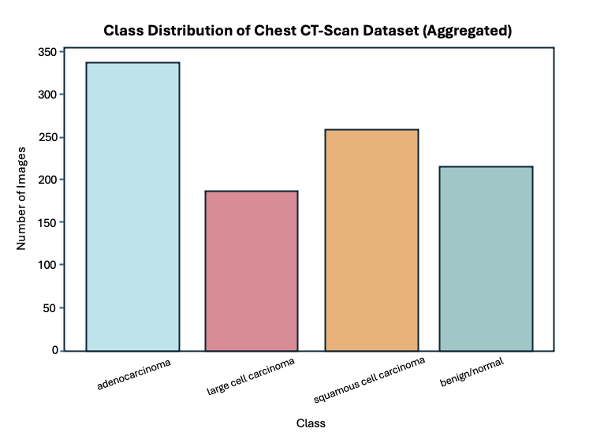
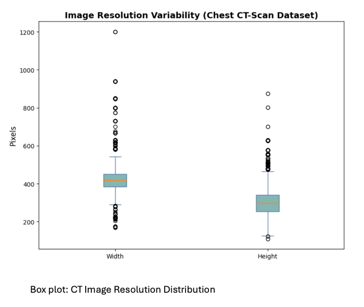
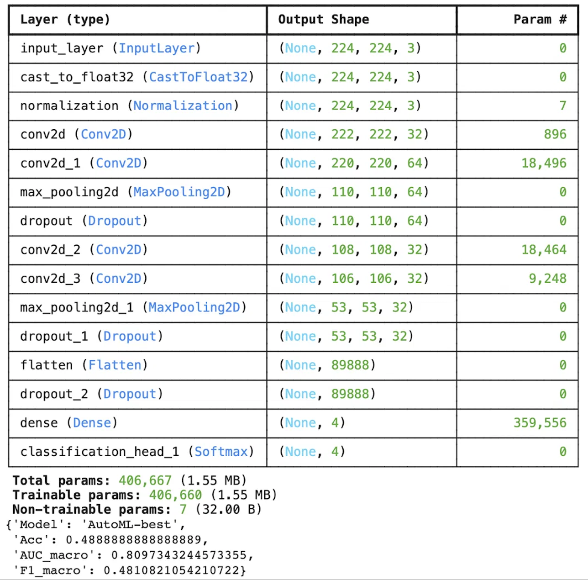
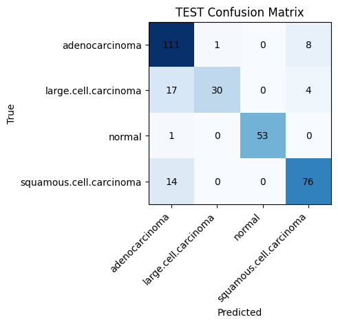
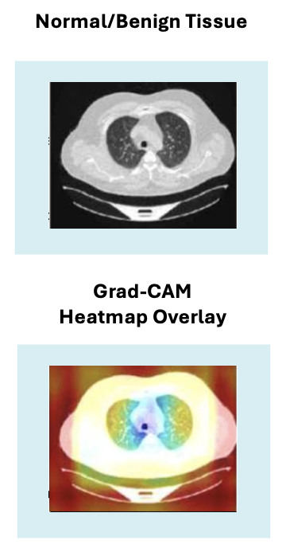

# Cancer Site Detection CNN — CT-Scan Imaging with Grad-CAM Explainability

A deep learning project for **lung cancer subtype classification from CT scans**, comparing three modeling strategies and deploying the winner as a live, interactive demo with explainability built in.

**🔗 [Live demo on Hugging Face](https://huggingface.co/spaces/ablackwellb/chest-ct-cancerscan)** · **▶️ [Project walkthrough on YouTube](https://youtu.be/qPS9zHlJQLY)**

---

## Overview

This project classifies chest CT-scan images into lung cancer subtypes (adenocarcinoma, large-cell carcinoma, squamous-cell carcinoma) versus normal tissue. Rather than building a single model, I benchmarked three distinct approaches to determine the most accurate *and* generalizable strategy on a small, class-imbalanced medical imaging dataset — then deployed the strongest model with Grad-CAM explainability so its predictions can be visually interrogated, not just trusted blindly.

## Dataset

A public, four-class chest CT-scan dataset from Kaggle (three cancer subtypes + normal), with meaningful class imbalance — a realistic constraint that shaped every modeling decision below.
Dataset source: [Chest CT-Scan Images (Kaggle)](https://www.kaggle.com/datasets/hanyhossam/chest-ctscan-images-dataset)

## Exploratory Data Analysis

The four classes are meaningfully imbalanced — adenocarcinoma is the largest group, large-cell carcinoma the smallest — which shaped every modeling decision below (class weighting, and the baseline CNN's collapse into a single class).

Source images also varied widely in resolution, motivating a uniform resize to 224×224 before training.

## Approach — Three-Model Comparison

| Model | Test Accuracy | Macro-F1 | Macro-AUC | Notes |
|---|---|---|---|---|
| Baseline CNN (from scratch) | 28.6% | 0.11 | — | Collapsed onto a single class — predicted one subtype for every image. AUC omitted as uninformative (unstable across runs). |
| AutoKeras (AutoML / NAS) | 48.9% | 0.48 | 0.81 | Beat the baseline but remained limited. |
| **EfficientNetB0 (transfer learning)** | **84.4%** | **0.83** | **0.97** | **Winner of the head-to-head benchmark** — then refined and deployed at 85.7% (see below). |

The three approaches were benchmarked head-to-head in `model_comparison.ipynb`, where EfficientNetB0 won at 84.4% test accuracy. The final model was then refined (the training schedule in `cancer_site_detection_cnn.ipynb`) and deployed, reaching **85.7%** test accuracy — the figure reported below and on the live demo.

The baseline failure was informative, not wasted: it demonstrated that a small imbalanced dataset couldn't support a from-scratch network, which is precisely what motivated the transfer-learning approach.

## Results — Selected Model (EfficientNetB0)

| Split | Accuracy | Macro-F1 | Macro-AUC |
|---|---|---|---|
| Validation | 83.33% | 0.8459 | 0.968 |
| Test | 85.71% | 0.8551 | 0.969 |

A macro-AUC of 0.969 on a multi-class clinical imaging task indicates strong separability across subtypes. The confusion matrix showed the model's main difficulty was distinguishing adenocarcinoma from large-cell carcinoma — an overlap that mirrors genuine diagnostic ambiguity radiologists themselves encounter, rather than an arbitrary model error.

## Explainability — Grad-CAM

To move beyond a black-box prediction, I implemented Grad-CAM (gradient-weighted class activation mapping). The resulting heatmaps confirm the model concentrates attention on clinically relevant lung regions rather than background artifacts — supporting interpretability and trust.

## Responsible Use

This model is a **decision-support prototype, not a diagnostic tool.** It is not a substitute for a trained radiologist and must not be used for clinical diagnosis. It was developed on a public, de-identified dataset with an emphasis on transparency, reproducibility, and honest reporting of its limitations — including the small dataset size and class imbalance noted above.

## Tech Stack

Python · TensorFlow / Keras · EfficientNetB0 (transfer learning) · AutoKeras · Grad-CAM · Gradio · Hugging Face Spaces · scikit-learn · NumPy · Matplotlib

## Repository Contents

- `cancer_site_detection_cnn.ipynb` — final EfficientNetB0 model + Grad-CAM (deployed)
- `model_comparison.ipynb` — head-to-head benchmark: baseline CNN vs AutoKeras vs EfficientNetB0
- `class_distribution_aggregated_hist.png`, `image_resolution_variability_boxplot.png` — EDA visuals
- `confusion_matrix.png`, `gradcam_example.png`, `AutoML_params.png` — results & explainability visuals
- `README.md`

## References

- Tan, M., & Le, Q. (2019). *EfficientNet: Rethinking Model Scaling for Convolutional Neural Networks.* ICML.
- Topol, E. (2019). *High-performance medicine: the convergence of human and artificial intelligence.* Nature Medicine.
- Shen, D., Wu, G., & Suk, H.-I. (2017). *Deep Learning in Medical Image Analysis.* Annual Review of Biomedical Engineering.
- Hany, M. (2020). Chest CT-Scan Images [Dataset]. Kaggle.

---

**Ashley Blackwell** — Applied Data Scientist
[LinkedIn](https://linkedin.com/in/ablackwellb) · [Hugging Face](https://huggingface.co/ablackwellb) · [Tableau Public](https://public.tableau.com/app/profile/ablackwellb)
